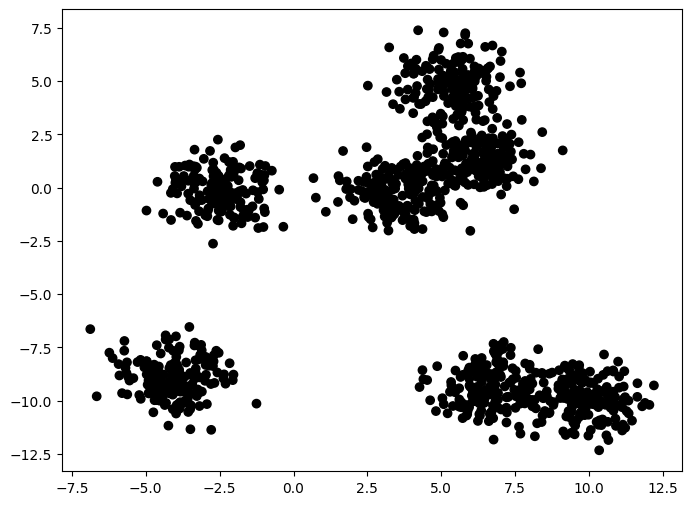
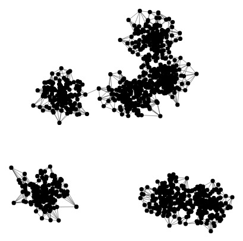
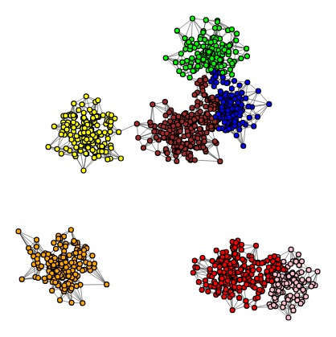
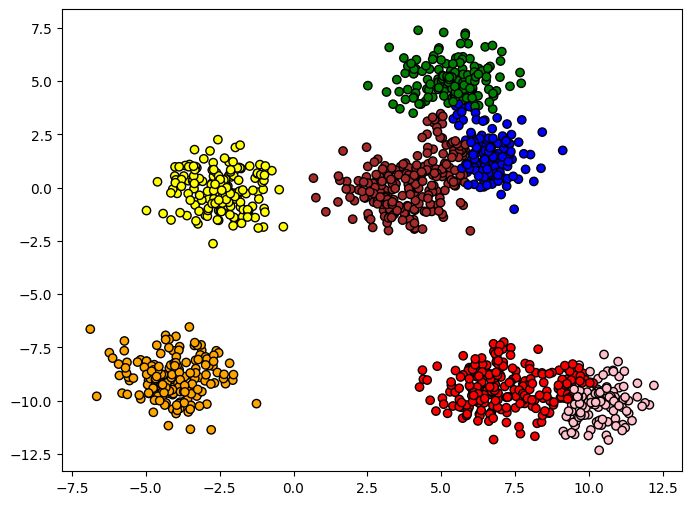
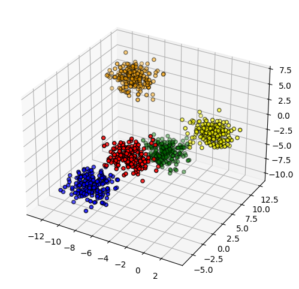
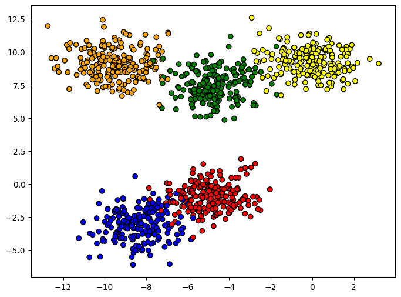
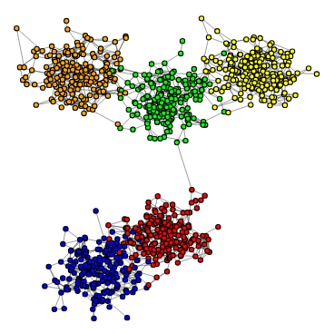
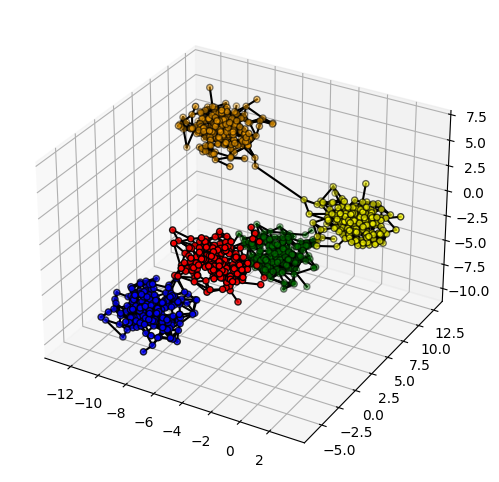

# Graph-Clustering-Framework

## Proposal

The main idea is to define a dataset:

Transform the original data into a graph:

Apply a community detection algorithm:

And then project the communities as groups onto the original data:

## Input format
We use `X,y = sklearn.datasets.make_blobs(n_samples, n_features, centers, cluster_std, random_state)`to create an artificial the data base.

We also create a list os colors `colors = ['red', 'green', 'orange', 'yellow', 'blue'......]` the number of colors == centers

You can plot by doing:

~~~python
X, y = dt.make_blobs(n_samples = 1000, n_features = 3, centers = 5, cluster_std = 1.1, random_state = 33)

colors = ['red', 'green', 'orange', 'yellow', 'blue']

plot_grafico3(X, y, colors)

plot_grafico2(X, y, colors)
~~~

## Example

After defining a database (X, y), we can use some of the Graph Construction Algorithm, for example the MKNN (X,k).

~~~python
def components(W):
  g = Graph.Weighted_Adjacency(W.todense(), mode='undirected', attr='weight', loops=False)
  return len(g.connected_components())

def MKNN(X,k):
  W = kneighbors_graph(X, k, mode='distance', metric='euclidean', include_self=False)
  W = W.minimum(W.T)
  if components(W) > 1:
     W = W + mst_graph(X,'euclidean')
  g2 = Graph.Weighted_Adjacency(W.todense(), mode='undirected', attr='weight', loops=False)
  return g2
~~~

Then:

~~~python
g2 = MKNN(X,10)

# Plot

# 2D Graph
plot_2d_graph(g2, y=y, X=X, ind=range(0, g2.vcount()), colors=colors)

#3D Graph
plot_grafico3(X, y, colors, g2)
~~~

## References
>KNN

  >> Eppstein, D., Paterson, M.S. & Yao, F.F. On Nearest-Neighbor Graphs. Discrete Comput Geom 17, 263–282 (1997).

  >>Maier, Markus & Hein, Matthias & Luxburg, Ulrike. (2007). Cluster Identification in Nearest-Neighbor Graphs. Proceedings of the 18th International Confererence on Algorithmic   Learning Theory (ALT 2007), 196-210 (2007). 4754. 196-210. 10.1007/978-3-540-75225-7_18.

>Epsilon

 >> M. Maier, U. von Luxburg, and M. Hein. Influence of graph construction on graph-based clustering measures. The Neural Information Processing Systems, 22:1025–1032, 2009

 >> Partha Pratim Talukdar, "Topics in Graph Construction for Semi-Supervised Learning", Technical Report, University of Pennsylvania. August 2009.

>MkNN

  >>Kohei Ozaki, Masashi Shimbo, Mamoru Komachi, and Yuji Matsumoto. 2011. Using the mutual k-nearest neighbor graphs for semi-supervised classification of natural language data.   In Proceedings of the Fifteenth Conference on Computational Natural Language Learning (CoNLL '11). Association for Computational Linguistics, USA, 154–162.

  >>Gowda, K. Chidananda, and G. Krishna. "Agglomerative clustering using the concept of mutual nearest neighbourhood." Pattern recognition 10.2 (1978): 105-112.

  >>Brito, Maria R., et al. "Connectivity of the mutual k-nearest-neighbor graph in clustering and outlier detection." Statistics & Probability Letters 35.1 (1997): 33-42.

  >>Maier, Markus & Hein, Matthias & Luxburg, Ulrike. (2007). Cluster Identification in Nearest-Neighbor Graphs. Proceedings of the 18th International Confererence on Algorithmic   Learning Theory (ALT 2007), 196-210 (2007). 4754. 196-210. 10.1007/978-3-540-75225-7_18.

>B-matching

  >>Tony Jebara, Jun Wang, and Shih-Fu Chang. 2009. Graph construction and b-matching for semi-supervised learning. In Proceedings of the 26th Annual International Conference on     Machine Learning (ICML '09).

 >> Huang, Bert, and Tony Jebara. "Fast b-matching via sufficient selection belief propagation." Proceedings of the Fourteenth International Conference on Artificial Intelligence   and Statistics. JMLR Workshop and Conference Proceedings, 2011.

 >> Pothen, A., Ferdous, S., & Manne, F. (2019). Approximation algorithms in combinatorial scientific computing. Acta Numerica, 28, 541-633.

 >> Yasuhiro Fujiwara, Atsutoshi Kumagai, Sekitoshi Kanai, Yasutoshi Ida, and Naonori Ueda. 2020. Efficient Algorithm for the b-Matching Graph. In Proceedings of the 26th ACM       SIGKDD International Conference on Knowledge Discovery & Data Mining (KDD '20).

 >> Khan, Arif and Pothen, Alex and Patwary, Md. Mostofa Ali and Satish, Nadathur and Sundaram, Narayanan and Manne, Fredrik and Halappanavar, Mahantesh and Dubey, Pradeep.       
  (2016). Efficient Approximation Algorithms for Weighted b-Matching. SIAM Journal on Scientific Computing. 38. S593-S619.

>Bipartite:

 >> Asratian, Armen S., Tristan MJ Denley, and Roland Häggkvist. Bipartite graphs and their applications. Vol. 131. Cambridge university press, 1998.

 >> Jean-Loup Guillaume, Matthieu Latapy, Bipartite graphs as models of complex networks, Physica A: Statistical Mechanics and its Applications, Volume 371, Issue 2, 2006, Pages    795-813.

>GBLP

  >>Berton, Lilian, Jorge Valverde-Rebaza, and Alneu de Andrade Lopes. "Link prediction in graph construction for supervised and semi-supervised learning." 2015 International Joint Conference on Neural Networks (IJCNN). IEEE, 2015.
  
>S-KNN

  >>Didier A Vega-Oliveros and Lilian Berton and Andre Mantini Eberle and Alneu de Andrade Lopes and Liang Zhao. Regular graph construction for semi-supervised learning, Journal    of Physics: Conference Series, p. 012022, 2014.
  
>MST

  >>R. L. Graham and P. Hell, "On the History of the Minimum Spanning Tree Problem," in Annals of the History of Computing, vol. 7, no. 1, pp. 43-57, Jan.-March 1985, doi:10.1109/MAHC.1985.10011.

  >>Cormen, Thomas H., et al. Introduction to algorithms. MIT press, 2009.

  >>Pettie, Seth and Ramachandran, Vijaya. An Optimal Minimum Spanning Tree Algorithm, Automata, Languages and Programming, p. 49--60, 2000.

>RMST

  >>Beguerisse-Díaz, Mariano, Borislav Vangelov, and Mauricio Barahona. Finding role communities in directed networks using role-based similarity, markov stability and the 
  relaxed minimum spanning tree. 2013 IEEE Global Conference on Signal and Information Processing. IEEE, 2013.
  
>NNK

 >> S. Shekkizhar and A. Ortega, "Graph Construction from Data by Non-Negative Kernel Regression," ICASSP 2020 - 2020 IEEE International Conference on Acoustics, Speech and 
  Signal Processing (ICASSP), 2020, pp. 3892-3896, doi: 10.1109/ICASSP40776.2020.9054425.
  
>CKNN

  >>Tyrus Berry, Timothy Sauer. Consistent manifold representation for topological data analysis. Foundations of Data Science, 2019, 1 (1) : 1-38. doi: 10.3934/fods.2019001
