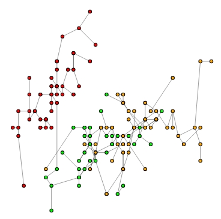
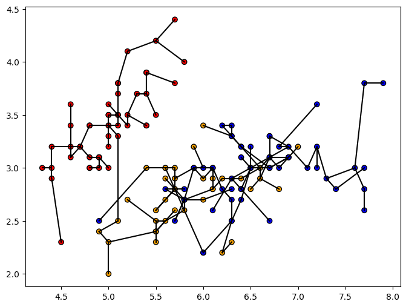
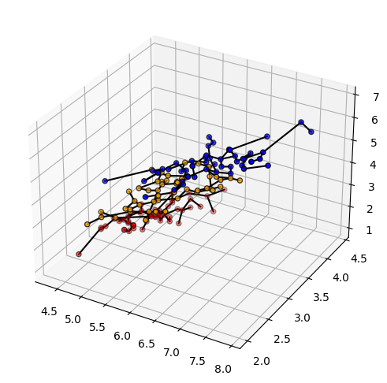
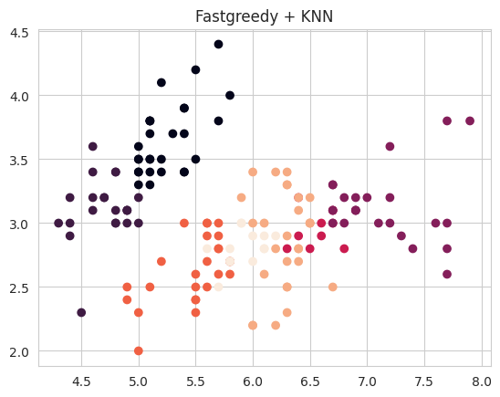
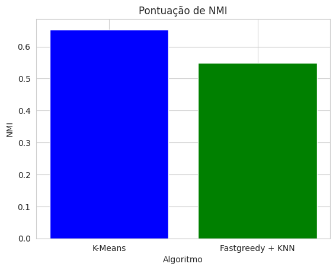
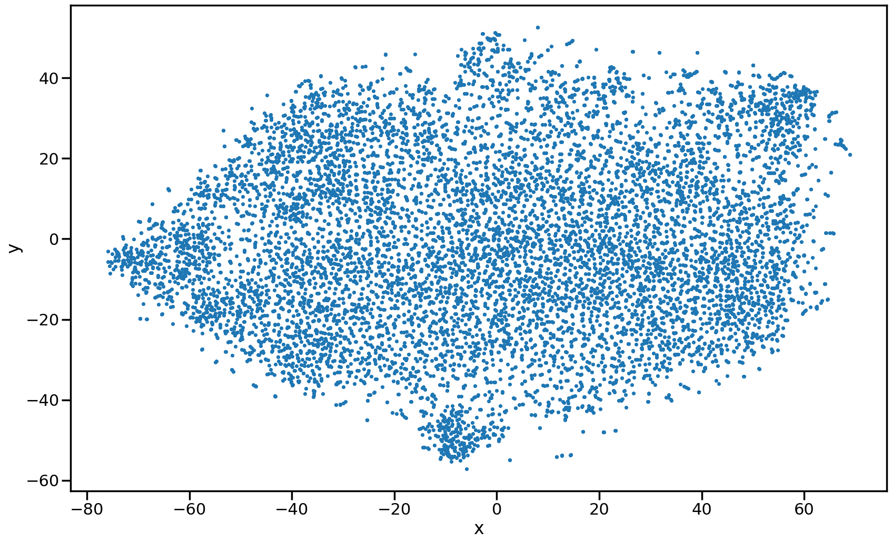
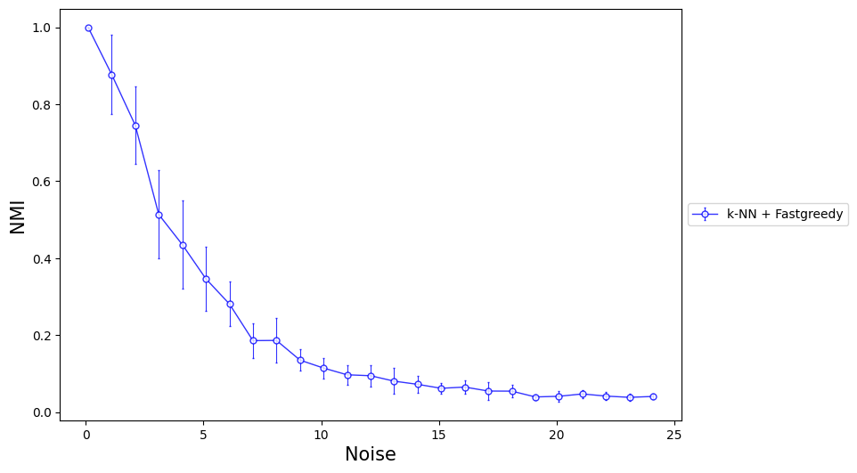
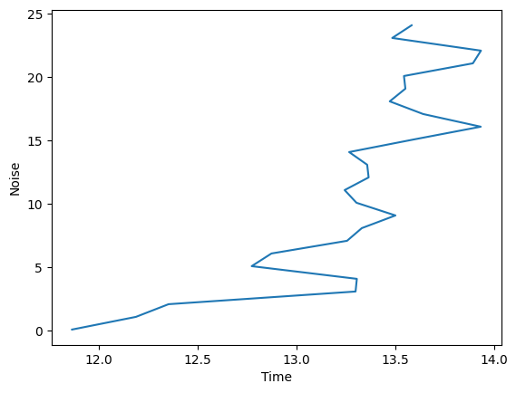

# Graph-Clustering-Framework

## Proposal

The main idea is to define a dataset:

Transform the original data into a graph:

Apply a community detection algorithm:

And then project the communities as groups onto the original data:

## Input format
We use `X,y = sklearn.datasets.make_blobs(n_samples, n_features, centers, cluster_std, random_state)`to create an artificial the data base.

We also create a list os colors `colors = ['red', 'green', 'orange', 'yellow', 'blue'......]` the number of colors == centers

You can plot by doing:

~~~python
X, y = dt.make_blobs(n_samples = 1000, n_features = 3, centers = 5, cluster_std = 1.1, random_state = 33)

colors = ['red', 'green', 'orange', 'yellow', 'blue']

plot_grafico3(X, y, colors)

plot_grafico2(X, y, colors)
~~~

## Example

After defining a database (X, y), we can use some of the Graph Construction Algorithm, for example the MKNN (X,k).

~~~python
def components(W):
  g = Graph.Weighted_Adjacency(W.todense(), mode='undirected', attr='weight', loops=False)
  return len(g.connected_components())

def MKNN(X,k):
  W = kneighbors_graph(X, k, mode='distance', metric='euclidean', include_self=False)
  W = W.minimum(W.T)
  if components(W) > 1:
     W = W + mst_graph(X,'euclidean')
  g2 = Graph.Weighted_Adjacency(W.todense(), mode='undirected', attr='weight', loops=False)
  return g2
~~~

Then:

~~~python
g2 = MKNN(X,10)

# Plot

# 2D Graph
plot_2d_graph(g2, y=y, X=X, ind=range(0, g2.vcount()), colors=colors)

#3D Graph
plot_grafico3(X, y, colors, g2)
~~~

## Iris Dataset
I also used Iris Dataset to make some graphs and clustering.
### Upload and Visualization

~~~python
Iris_dataset = pd.read_csv('Iris_dataset.csv')
px.scatter_3d(Iris_dataset, "sepal_length", "sepal_width", "petal_length",
             color="species", color_discrete_map = {"Joly": "blue", "Bergeron": "violet", "Coderre":"pink"})
~~~

### Graph constructions
~~~python
X = np.array(Iris_dataset[['sepal_length', 'sepal_width','petal_length', 'petal_width']])

y = Iris_dataset['species']
le = LabelEncoder()
y = le.fit_transform(y)

g, W = MST(X,'cosine')

print('Score Wrong Edges:', score_we(W, y))

# Plot

# Grafo 2D
plot_2d_graph(g, y=y, X=X, ind=range(0, g.vcount()), colors=colors)

plot_grafico2(X,y,colors,g)

#Grafo 3D
plot_grafico3(X, y, colors, g)
~~~

### Clustering example 
~~~python
X = np.array(Iris_dataset[['sepal_length', 'sepal_width', 'petal_width']])

#Aplicando Kmeans
kmeans = KMeans(n_clusters=3, random_state=42, n_init=10)
kmeans.fit(X)

labels_kmeans = kmeans.labels_

#Aplicando Fastgreedy
g, W = KNN(X, k=5, metric='euclidean')

# Convert W to a dense matrix
W_dense = W.toarray()

# Get the edge list from the graph
edges = g.get_edgelist()

# Create a weights vector with the same length as the number of edges
edge_weights = np.zeros(len(edges))

# Assign weights to each edge using the dense matrix
for i, edge in enumerate(edges):
    edge_weights[i] = W_dense[edge[0], edge[1]]

# Now you can pass edge_weights to the community_fastgreedy method
fastgreedy = Graph.community_fastgreedy(g, weights=edge_weights)
labels_fastgreedy = fastgreedy.as_clustering().membership

#Comparando
plt.scatter(X[:, 0], X[:, 1], c=labels_kmeans)
plt.title('Kmeans')
plt.show()

plt.scatter(X[:, 0], X[:, 1], c=labels_fastgreedy)
plt.title('Fastgreedy + KNN')
plt.show()

#NMI (Normalized Mutual Information)
labels_kmeans = kmeans.labels_
labels_fastgreedy = fastgreedy.as_clustering().membership

nmi_kmeans = normalized_mutual_info_score(y, labels_kmeans)
nmi_fastgreedy = normalized_mutual_info_score(y, labels_fastgreedy)

print()
print("NMI K-Means:", nmi_kmeans)
print("NMI Fastgreedy + KNN:", nmi_fastgreedy)
print()

plt.bar(["K-Means", "Fastgreedy + KNN"], [nmi_kmeans, nmi_fastgreedy], color=["blue", "green"])
plt.xlabel("Algoritmo")
plt.ylabel("NMI")
plt.title("Pontuação de NMI")
plt.show()
~~~

## NLP
You can also use the graph´s constructions methods to make graphs for NLP analytics. 
This example is a modified version of the code you find in: https://github.com/llSourcell/word_vectors_game_of_thrones-LIVE/blob/master/Thrones2Vec.ipynb
Remember you can analyse any txt text following this steps.

~~~python

## Importações

from __future__ import absolute_import, division, print_function

import codecs
import glob
import logging
import multiprocessing
import os
import pprint
import re

import nltk
import gensim.models.word2vec as w2v
import sklearn.manifold
import numpy as np
import matplotlib.pyplot as plt
import pandas as pd
import seaborn as sns

## Set up Log

logging.basicConfig(format='%(asctime)s : %(levelname)s : %(message)s', level=logging.INFO)

## Download NLTK tokenizer models

nltk.download("punkt")
nltk.download("stopwords")

## Load Data(Books)

book_filenames = sorted(glob.glob("/content/*.txt"))

print("Found books:")
book_filenames

## Combine the books into one string

corpus_raw = u""
for book_filename in book_filenames:
    print("Reading '{0}'...".format(book_filename))
    with codecs.open(book_filename, "r", "utf-8") as book_file:
        corpus_raw += book_file.read()
    print("Corpus is now {0} characters long".format(len(corpus_raw)))
    print()

## Lemmatize and remove stopwords

import nltk
from nltk.corpus import stopwords
import re

# Carrega a lista de stopwords em inglês
stop_words = set(stopwords.words('english'))

tokenizer = nltk.data.load('tokenizers/punkt/english.pickle')

raw_sentences = tokenizer.tokenize(corpus_raw)

def sentence_to_wordlist(raw):
    clean = re.sub("[^a-zA-Z]"," ", raw)
    words = clean.split()
    # Remove stopwords
    words = [word.lower() for word in words if word.lower() not in stop_words]
    return words

#sentence where each word is tokenized
sentences = []
for raw_sentence in raw_sentences:
    if len(raw_sentence) > 0:
        sentences.append(sentence_to_wordlist(raw_sentence))

print(raw_sentences[5])
print(sentence_to_wordlist(raw_sentences[5]))

token_count = sum([len(sentence) for sentence in sentences])
print("The book corpus contains {0:,} tokens".format(token_count))

## Train Word2Vec

#ONCE we have vectors
#step 3 - build model
#3 main tasks that vectors help with
#DISTANCE, SIMILARITY, RANKING

# Dimensionality of the resulting word vectors.
#more dimensions, more computationally expensive to train
#but also more accurate
#more dimensions = more generalized
num_features = 300
# Minimum word count threshold.
min_word_count = 3

# Number of threads to run in parallel.
#more workers, faster we train
num_workers = multiprocessing.cpu_count()

# Context window length.
context_size = 7

# Downsample setting for frequent words.
#0 - 1e-5 is good for this
downsampling = 1e-3

# Seed for the RNG, to make the results reproducible.
#random number generator
#deterministic, good for debugging
seed = 1

thrones2vec = w2v.Word2Vec(
    sg=1,
    seed=seed,
    workers=num_workers,
    vector_size=num_features ,
    min_count=min_word_count,
    window=context_size,
    sample=downsampling
)

thrones2vec.build_vocab(sentences)

print("Word2Vec vocabulary length:", len(thrones2vec.wv.key_to_index))

## Train

thrones2vec.train(sentences, total_examples=thrones2vec.corpus_count, epochs=10)

## Save

if not os.path.exists("trained"):
    os.makedirs("trained")

thrones2vec.save(os.path.join("trained", "thrones2vec.w2v"))

## Load

thrones2vec = w2v.Word2Vec.load(os.path.join("trained", "thrones2vec.w2v"))

## Dimension reduction

tsne = sklearn.manifold.TSNE(n_components=2, random_state=0)

all_word_vectors_matrix = thrones2vec.wv.vectors

all_word_vectors_matrix_2d = tsne.fit_transform(all_word_vectors_matrix)

Points = pd.DataFrame(
    [
        (word, coords[0], coords[1])
        for word, coords in [
            (word, all_word_vectors_matrix_2d[thrones2vec.wv.key_to_index[word]])
            for word in thrones2vec.wv.key_to_index
        ]
    ],
    columns=["word", "x", "y"]
)

Points.head()

## General View

sns.set_context("poster")

Points.plot.scatter("x", "y", s=10, figsize=(20, 12))

## Zoom into regions

def plot_region(x_bounds, y_bounds):
    slice = Points[
        (x_bounds[0] <= Points.x) &
        (Points.x <= x_bounds[1]) &
        (y_bounds[0] <= Points.y) &
        (Points.y <= y_bounds[1])
    ]

    ax = slice.plot.scatter("x", "y", s=35, figsize=(10, 8))
    for i, Point in slice.iterrows():
        ax.text(Point.x + 0.05, Point.y + 0.05, Point.word, fontsize=11)

plot_region(x_bounds=(40, 42), y_bounds=(-5, -1))

## Explore Similarities

thrones2vec.wv.most_similar("stark")

## Graph construction

print(all_word_vectors_matrix_2d)
type(all_word_vectors_matrix_2d)

X = all_word_vectors_matrix_2d
g, W= MST(X,'euclidian')

# Plot
# Grafo 2D
plot_2d_graph(g, X=X)
~~~

## Kmens x Fastegreedy

I can also evaluate the performance of a clustering algorithm, in the example below I used the Fastgreedy community detection algorithm and the K-NN graph construction method. I used a synthetic dataset with varying levels of noise. 

~~~python

#fastgreedy - KNN
nmi_fastgreedy_knn = []
std_fastgreedy_knn = []
all_fastgreedy_knn = []
time_ = []

noise = np.arange(0.1, 25, 1)
clusters = 5

for i in noise:
  print("Ruido {0}".format(i))

  time_start = time.time()

  aux_fastgreedy_knn = []
  aux_time = []

  for j in range(1, 10, 1):
    X, y = dt.make_blobs(n_samples=500, n_features=2, centers=clusters, cluster_std=i)

    #knn
    _max_fastgreedy = 0.0
    _max_infomap = 0.0
    _max_leading = 0.0
    membership = []
    for k in range(1, 40, 1):
      g = KNN(X,k)
      #fastgreedy
      dendogram_fastgreedy = g.community_fastgreedy(weights="weight")
      try:
        labels_fastgreedy = dendogram_fastgreedy.as_clustering(n=clusters)
      except:
        continue
      score_fastgreedy = normalized_mutual_info_score(y, labels_fastgreedy.membership)
      if score_fastgreedy > _max_fastgreedy:
        _max_fastgreedy = score_fastgreedy

    aux_fastgreedy_knn.append(_max_fastgreedy)

  time_finish = time.time()
  time_exec = time_finish - time_start
  aux_time.append(time_exec)

  nmi_fastgreedy_knn.append(np.mean(aux_fastgreedy_knn))
  std_fastgreedy_knn.append(np.std(aux_fastgreedy_knn))
  all_fastgreedy_knn.extend(nmi_fastgreedy_knn)
  time_.extend(aux_time)

plt.figure(figsize=(9,6))
err_param = dict(linewidth=1.0, markersize=5, alpha=0.8, mfc='white', markeredgewidth=1.0, capsize=1, capthick=1.8, elinewidth=0.8)
plt.errorbar(noise, nmi_fastgreedy_knn, std_fastgreedy_knn, label='k-NN + Fastgreedy', color='b', marker='o', **err_param)

plt.xlabel('Noise', fontsize = 15)
plt.ylabel('NMI', fontsize = 15)
plt.legend(loc='center left', bbox_to_anchor=(1, 0.5))
plt.show(True)

print("k-NN + Fastgreedy:", "Mean:", np.mean(all_fastgreedy_knn), "STD:", np.std(all_fastgreedy_knn))

data = pd.DataFrame()
data['k-NN + Fastgreedy'] = nmi_fastgreedy_knn

print(data)

~~~

> Initialization

The code initializes several empty lists to store results: nmi_fastgreedy_knn, std_fastgreedy_knn, all_fastgreedy_knn, and time_.
It defines a range of noise levels (noise) from 0.1 to 25, with a step size of 1.
It sets the number of clusters (clusters) to 5.

> Main Loop

The code loops through each noise level (i) in the noise range.

For each noise level, it:

  1. Prints the current noise level.

  2. Starts a timer using time.time().

Initializes two empty lists: aux_fastgreedy_knn to store the maximum NMI (Normalized Mutual Information) scores for each iteration, and aux_time to store the execution time for each iteration.

Loops through 9 iterations (j ranges from 1 to 10, with a step size of 1).

For each iteration, it:

  1. Generates a synthetic dataset using make_blobs from scikit-learn, with 500 samples, 2 features, 5 clusters, and a standard deviation of i (the current noise level).
  
  2. Creates a K-NN graph using the KNN function (not a standard scikit-learn function, so it's likely a custom implementation).
  
  3. Applies the Fastgreedy community detection algorithm to the graph, and extracts the clustering labels.
  
  4. Computes the NMI score between the true labels (y) and the predicted labels using normalized_mutual_info_score from scikit-learn.
  
  5. Updates the maximum NMI score (_max_fastgreedy) if the current score is higher.
  
  6. Appends the maximum NMI score to aux_fastgreedy_knn.
  
  7. Stops the timer and appends the execution time to aux_time.
  
  8. Computes the mean and standard deviation of the NMI scores in aux_fastgreedy_knn, and appends them to nmi_fastgreedy_knn and std_fastgreedy_knn, respectively.
  
  9. Extends all_fastgreedy_knn with the mean NMI scores, and time_ with the execution times.

> Plotting

The code creates a figure with a single plot using matplotlib.
It plots the mean NMI scores (nmi_fastgreedy_knn) against the noise levels (noise), with error bars representing the standard deviation (std_fastgreedy_knn).
It sets labels, title, and legend for the plot.
Final Output

The code prints the mean and standard deviation of the NMI scores across all noise levels.
It creates a Pandas DataFrame with the NMI scores and prints it.

In summary, this code evaluates the performance of the Fastgreedy community detection algorithm on a synthetic dataset with varying levels of noise, using the K-NN graph construction method. It plots the NMI scores against the noise levels and provides summary statistics.

~~~python
y = noise
x = time_

fig, ax = plt.subplots()

ax.plot(x,y)

ax.set_xlabel('Time')
ax.set_ylabel('Ruido')

plt.show()
~~~

This code is creating a simple line plot using matplotlib to visualize the relationship between the execution time (time_) and the noise level (noise).

## References
>KNN

  >> Eppstein, D., Paterson, M.S. & Yao, F.F. On Nearest-Neighbor Graphs. Discrete Comput Geom 17, 263–282 (1997).

  >>Maier, Markus & Hein, Matthias & Luxburg, Ulrike. (2007). Cluster Identification in Nearest-Neighbor Graphs. Proceedings of the 18th International Confererence on Algorithmic   Learning Theory (ALT 2007), 196-210 (2007). 4754. 196-210. 10.1007/978-3-540-75225-7_18.

>Epsilon

 >> M. Maier, U. von Luxburg, and M. Hein. Influence of graph construction on graph-based clustering measures. The Neural Information Processing Systems, 22:1025–1032, 2009

 >> Partha Pratim Talukdar, "Topics in Graph Construction for Semi-Supervised Learning", Technical Report, University of Pennsylvania. August 2009.

>MkNN

  >>Kohei Ozaki, Masashi Shimbo, Mamoru Komachi, and Yuji Matsumoto. 2011. Using the mutual k-nearest neighbor graphs for semi-supervised classification of natural language data.   In Proceedings of the Fifteenth Conference on Computational Natural Language Learning (CoNLL '11). Association for Computational Linguistics, USA, 154–162.

  >>Gowda, K. Chidananda, and G. Krishna. "Agglomerative clustering using the concept of mutual nearest neighbourhood." Pattern recognition 10.2 (1978): 105-112.

  >>Brito, Maria R., et al. "Connectivity of the mutual k-nearest-neighbor graph in clustering and outlier detection." Statistics & Probability Letters 35.1 (1997): 33-42.

  >>Maier, Markus & Hein, Matthias & Luxburg, Ulrike. (2007). Cluster Identification in Nearest-Neighbor Graphs. Proceedings of the 18th International Confererence on Algorithmic   Learning Theory (ALT 2007), 196-210 (2007). 4754. 196-210. 10.1007/978-3-540-75225-7_18.

>B-matching

  >>Tony Jebara, Jun Wang, and Shih-Fu Chang. 2009. Graph construction and b-matching for semi-supervised learning. In Proceedings of the 26th Annual International Conference on     Machine Learning (ICML '09).

 >> Huang, Bert, and Tony Jebara. "Fast b-matching via sufficient selection belief propagation." Proceedings of the Fourteenth International Conference on Artificial Intelligence   and Statistics. JMLR Workshop and Conference Proceedings, 2011.

 >> Pothen, A., Ferdous, S., & Manne, F. (2019). Approximation algorithms in combinatorial scientific computing. Acta Numerica, 28, 541-633.

 >> Yasuhiro Fujiwara, Atsutoshi Kumagai, Sekitoshi Kanai, Yasutoshi Ida, and Naonori Ueda. 2020. Efficient Algorithm for the b-Matching Graph. In Proceedings of the 26th ACM       SIGKDD International Conference on Knowledge Discovery & Data Mining (KDD '20).

 >> Khan, Arif and Pothen, Alex and Patwary, Md. Mostofa Ali and Satish, Nadathur and Sundaram, Narayanan and Manne, Fredrik and Halappanavar, Mahantesh and Dubey, Pradeep.       
  (2016). Efficient Approximation Algorithms for Weighted b-Matching. SIAM Journal on Scientific Computing. 38. S593-S619.

>Bipartite:

 >> Asratian, Armen S., Tristan MJ Denley, and Roland Häggkvist. Bipartite graphs and their applications. Vol. 131. Cambridge university press, 1998.

 >> Jean-Loup Guillaume, Matthieu Latapy, Bipartite graphs as models of complex networks, Physica A: Statistical Mechanics and its Applications, Volume 371, Issue 2, 2006, Pages    795-813.

>GBLP

  >>Berton, Lilian, Jorge Valverde-Rebaza, and Alneu de Andrade Lopes. "Link prediction in graph construction for supervised and semi-supervised learning." 2015 International Joint Conference on Neural Networks (IJCNN). IEEE, 2015.
  
>S-KNN

  >>Didier A Vega-Oliveros and Lilian Berton and Andre Mantini Eberle and Alneu de Andrade Lopes and Liang Zhao. Regular graph construction for semi-supervised learning, Journal    of Physics: Conference Series, p. 012022, 2014.
  
>MST

  >>R. L. Graham and P. Hell, "On the History of the Minimum Spanning Tree Problem," in Annals of the History of Computing, vol. 7, no. 1, pp. 43-57, Jan.-March 1985, doi:10.1109/MAHC.1985.10011.

  >>Cormen, Thomas H., et al. Introduction to algorithms. MIT press, 2009.

  >>Pettie, Seth and Ramachandran, Vijaya. An Optimal Minimum Spanning Tree Algorithm, Automata, Languages and Programming, p. 49--60, 2000.

>RMST

  >>Beguerisse-Díaz, Mariano, Borislav Vangelov, and Mauricio Barahona. Finding role communities in directed networks using role-based similarity, markov stability and the 
  relaxed minimum spanning tree. 2013 IEEE Global Conference on Signal and Information Processing. IEEE, 2013.
  
>NNK

 >> S. Shekkizhar and A. Ortega, "Graph Construction from Data by Non-Negative Kernel Regression," ICASSP 2020 - 2020 IEEE International Conference on Acoustics, Speech and 
  Signal Processing (ICASSP), 2020, pp. 3892-3896, doi: 10.1109/ICASSP40776.2020.9054425.
  
>CKNN

  >>Tyrus Berry, Timothy Sauer. Consistent manifold representation for topological data analysis. Foundations of Data Science, 2019, 1 (1) : 1-38. doi: 10.3934/fods.2019001
